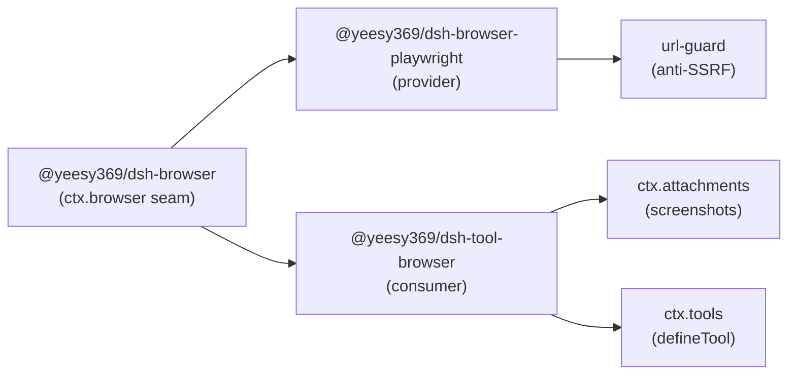

# dsh-browser

Browser capability for [DeepSeek Harness](https://github.com/deepseek-ai/deepseek-harness) (`dsh`) — the agent framework where everything is a plugin.

`dsh` ships filesystem, shell, search, and fetch primitives, but it has **no browser**: there is no `ctx.browser` seam, no provider, and no model-facing tools for opening, reading, or driving a real web page. This repository adds that missing capability as three `dsh`-style packages, following the same Service Definition / Provider / Consumer model the rest of the harness uses.

> 中文说明见 [README.zh.md](./README.zh.md)。

## Background

[DeepSeek Harness](https://github.com/deepseek-ai/deepseek-harness) (`dsh`) is an open-source agent harness built by DeepSeek AI. Its core idea is **everything is a plugin** — even the model adapter, tool registry, session log, and agent loop are plugins ([source](https://github.com/deepseek-ai/deepseek-harness/blob/master/README.md)).

`dsh` already ships a **web access seam** (`ctx.web`) that spans two operations, search and fetch ([`docs/subsystems/web.md`](https://github.com/deepseek-ai/deepseek-harness/blob/master/docs/subsystems/web.md)). It does **not** ship a browser: there is no `ctx.browser` seam, no browser provider, and no browser tools — the [`packages/web/`](https://github.com/deepseek-ai/deepseek-harness/tree/master/packages/web) tree contains only `web`, `tool-web`, `web-fetch-http`, and the `web-search-*` providers.

## Problems this project solves

`dsh-browser` exists because of three documented gaps in `dsh`'s web story:

1. **The shipped fetch backend is an SSRF primitive, disabled by default.** The official [`dsh-web-fetch-http` README](https://github.com/deepseek-ai/deepseek-harness/blob/master/packages/web/web-fetch-http/README.md) states:

   > SSRF / private-network protection is deferred — no blocking of private, loopback, link-local, multicast, or otherwise non-public destinations... Until it lands, this provider is an SSRF primitive and **must not be enabled** in a deployment that can reach sensitive internal network targets.

   The shipped base bundle reflects this: [`tool-web` is configured with `fetch: false`](https://github.com/deepseek-ai/deepseek-harness/blob/master/packages/bundle/base/cordis.patch.yml) and no fetch provider is mounted by default.

2. **There is no browser capability at all.** `dsh` can search and (conditionally) fetch, but it cannot open, read, or drive a real web page.

3. **Web access has no authorization policy.** The official [`dsh-tool-web` README](https://github.com/deepseek-ai/deepseek-harness/blob/master/packages/web/tool-web/README.md) states:

   > No web-specific permission policy — both tools execute without requesting `ctx.approval`... the package does not define persistent URL/domain grants.

## Purpose

This project adds the missing **browser capability** to DeepSeek Harness on a **safe-by-default foundation**:

- Provide a real `ctx.browser` seam (Service Definition / Provider / Consumer) so the model can open, snapshot, click, type, and screenshot a page.
- Make navigation **SSRF-safe before it ships** — closing the deferred item documented in `dsh-web-fetch-http`.
- Add a web **permission gate** (`@yeesy369/dsh-web-permission`) so outbound and page-mutating actions are allowlisted, denylisted, or approved.

## Packages

| Package | Role | What it does |
|---|---|---|
| [`@yeesy369/dsh-browser`](./packages/browser) | Service Definition | Declares the `ctx.browser` seam (`BrowserRuntime`, `BrowserPage`, typed results). |
| [`@yeesy369/dsh-browser-playwright`](./packages/browser-playwright) | Service Provider | Implements `ctx.browser` with a headless Playwright browser. |
| [`@yeesy369/dsh-tool-browser`](./packages/tool-browser) | Consumer | Registers `browser_navigate`, `browser_snapshot`, `browser_click`, `browser_type`, `browser_back`, and `browser_screenshot`. |
| [`@yeesy369/dsh-web-permission`](./packages/web-permission) | Hook | Gates web/browser tools via `tools/pre-execute` (allowlist / denylist / ask). |

The Service Definition is a pure library (types + abstract class); the Provider, Consumer, and permission gate are installable bundles.

## Architecture



- **Service Definition** declares `BrowserRuntime extends Service` and augments `Context` with `ctx.browser`.
- **Provider** subclasses `BrowserRuntime`, launches Chromium via Playwright, and wraps pages in a `BrowserPage` that enforces URL safety.
- **Consumer** injects `['tools', 'browser', 'attachments']` and registers six tools with typed schemas; `browser_screenshot` commits PNG bytes through `ctx.attachments.saveImage`.

The full design lives in [docs/architecture.md](./docs/architecture.md).

## Model-facing tools

| Tool | Side effects | Notes |
|---|---|---|
| `browser_navigate` | network | URL is SSRF-checked |
| `browser_snapshot` | none | accessibility snapshot (fallback: body text) |
| `browser_screenshot` | image | stored as a durable attachment |
| `browser_click` | page mutation | CSS selector |
| `browser_type` | page mutation | types into focused element |
| `browser_back` | history | |

## Install

Packages are published to npm under the `@yeesy369` scope (one bundle per package). One command:

```sh
dsh plugin --profile web add @yeesy369/dsh-browser-playwright @yeesy369/dsh-tool-browser @yeesy369/dsh-web-permission
```

Windows one-click: `powershell -ExecutionPolicy Bypass -File scripts/install.ps1` (installs the bundles and adds an example `allowHosts` entry to `cordis.patch.yml`). Restart the profile (`Ctrl+C`, then `dsh web`) afterwards.

The provider runs **real-user mode by default**: headed Microsoft Edge (`channel: 'msedge'`, Chrome as fallback), a persistent profile under `~/.dsh/edge-profile` (cookies/logins survive restarts), reduced automation fingerprints (`--disable-blink-features=AutomationControlled`, `navigator.webdriver` hidden via init script), and it auto-relaunches if the window is closed. Falls back to Playwright's bundled Chromium when no real browser is installed. `@yeesy369/dsh-web-permission` (the permission gate) defaults to `allow` for hosts outside the allow/deny lists — review `cordis.patch.yml` if you need stricter defaults.

During development, load the packages from source with a `--patch` overlay:

```sh
pnpm install
pnpm build
dsh --profile web --patch packages/browser-playwright/cordis.patch.yml --patch packages/tool-browser/cordis.patch.yml --patch packages/web-permission/cordis.patch.yml
```

> Git-install of a monorepo subdirectory is not a supported first-class `dsh plugin` path; the npm packages above are the supported distribution. See [docs/architecture.md](./docs/architecture.md) for the exact patch rows.

## Security model

`browser-playwright/src/url-guard.ts` owns URL safety. Before navigation it:

1. rejects non-`http(s)` schemes and URLs with embedded credentials;
2. blocks a default hostname list (`localhost`, cloud metadata endpoints, …);
3. rejects private/loopback/link-local/multicast/reserved IP literals;
4. resolves the hostname and rejects any result that is non-public (DNS resolve-then-validate).

Known residual risk: Playwright owns the network stack, so a TOCTOU exists between the guard's DNS check and the browser's own connection. A proxy or `--host-resolver-rules` pin is the documented follow-up. Never enable private targets on a network that can reach sensitive internal hosts.

## Configuration

`@yeesy369/dsh-web-permission` reads its settings from `$DSH_HOME/settings.yaml`, which is **hot-reloaded** — edit it without restarting `dsh`:

```yaml
web-permission:
  allowHosts:
    - example.com
  denyHosts:
    - evil.com
  defaultAction: allow   # or ask
  gatedTools:
    - browser_navigate
    - web_fetch
```

- `allowHosts` / `denyHosts` — hostname allowlist / denylist (denylist wins).
- `defaultAction` — what to do with hosts in neither list: `allow` (default) or `ask` (require approval).
- `gatedTools` — which model-facing tools the gate inspects.

The same fields can be set at composition time in `cordis.patch.yml`; the `settings.yaml` user layer overrides them without a restart.

## Status

This is an **alpha** project built against `dsh` `0.1.0-rc.x` (currently resolving to `0.1.0-rc.6`) and Cordis `4.x`. `pnpm install`, `pnpm build`, `pnpm typecheck`, and `pnpm test` all pass. The URL-guard unit tests cover the SSRF scheme/hostname/IP-literal matrix, the permission policy is unit-tested, and `pnpm test:e2e` drives a real headless Chromium (navigate, snapshot, screenshot, SSRF rejection).

## Development

```sh
pnpm install
pnpm build
pnpm typecheck
pnpm test          # unit tests (url-guard, permission policy)
pnpm test:e2e      # real headless Chromium; install first: pnpm playwright install chromium
```

See [AGENTS.md](./AGENTS.md) for repository conventions and [LICENSE](./LICENSE) for terms (MIT).
